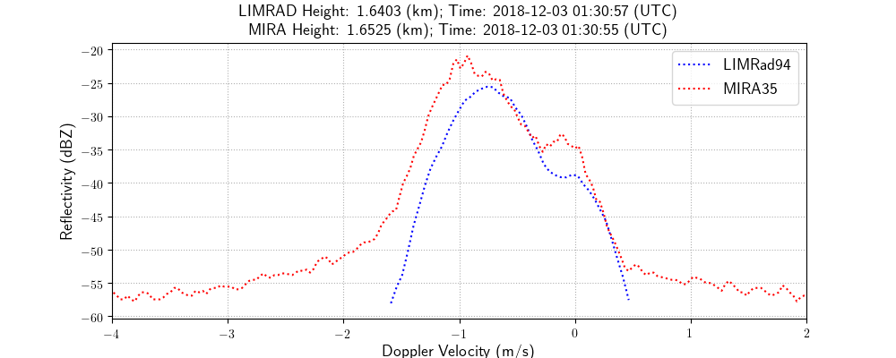
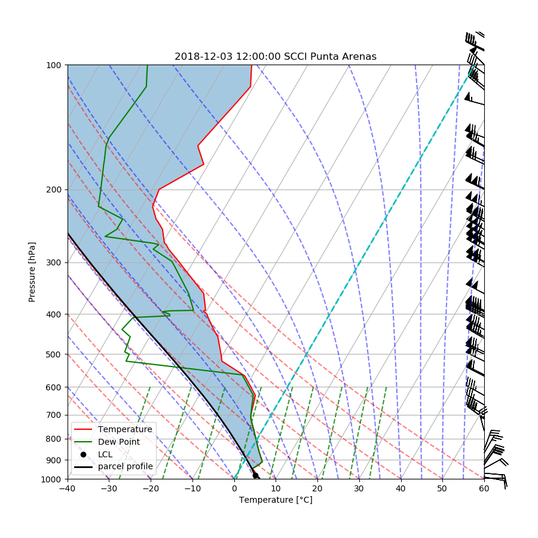
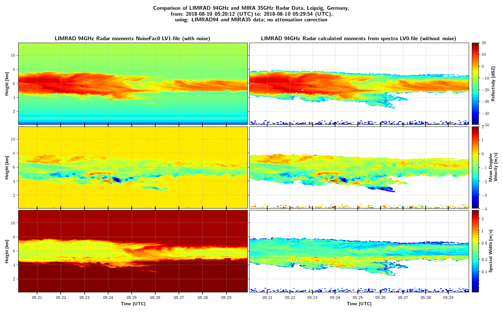

# Description

This is version 0.1 of the Meteorological-Data-Comparision Toolbox. It's perpous is the investigation of RPG 94GHz FMCW Radar 'LIMRAD94' and Metek 35GHz Pulse Radar 'MIRA35' data files. The user is able generates quicklooks for investigation of radar moments (Ze, mdv, sw, ldr), looking at specific Doppler spectras, plotting them, convert LIMRAD94 data to Cloudnet processing format, etc.


# Installation

  1.  install Python 3.6 or later verisons, e.g. go to https://www.anaconda.com/download/ and pick a download depending on your operating system (this may take a while)
      
  
  2.  the following packages are necessary, type: conda install [packagename]
     
     $ conda install -c anaconda numpy
     $ conda install -c conda-forge matplotlib
     $ conda install -c conda-forge netcdf4
     $ conda install -c anaconda numba 
     $ conda install -c anaconda scipy 
        
  3. Make a copy of Parameter_Mod.py_untouched and save it as Parameter_Mod.py. 
     Then define global paths in Parameter_Mod. **NOTE: Do not delete or overwrite Parameter_Mod.py_untouched!**
     
    $ cp Parameter_Mod.py_untouched Parameter_Mod.py
    
   Then specify your local paths, e.g.:
   ```python
   meteo_path  = '[user]/data/MeteoData/'              # path where output is stored, e.g.: png, log, txt
   LIMRAD_path = '[user]/data/MeteoData/LIMRAD94/'     # main path to LIMRAD94 NetCDF files
   MIRA_path   = '[user]/data/MeteoData/MIRA/'         # main path to MIRA NetCDF files
   ```
   
   The folder structure is as follows:
    
      .../MIRA_parth/mmclx/[files].mmclx
             --"--  /calibrated/[files].mira
             --"--  /spectra/[files].nc4
                 
      .../LIMRAD_path/calibrated/[momentfiles].LV1.NC   
                   --"--        /[spectrafiles].LV0.NC           
          
  

# Examples

The scripts/ subfolder contains different excecutable programs. The list below summarizes the main task of these scripts.
 
 - **compare_LIMRad-MIRA_spectra.py:** Generating plots of LIMRAD94 and MIRA35 spectra.
 
    
   
 - **download_plot_sounding.py:** Download soundings and save plot + metadata of station 'SCCI' (Chile) provided by http://weather.uwyo.edu/upperair/sounding.html. Two external packages have to be installed:
     
       $ conda install -c conda-forge metpy
       $ conda install -c conda-forge siphon
 
   Input parameter: YYYY MM DD HH. Example call for the routine: 
 
       $ python download_plot_sounding.py 2018 12 3 12
    
    
 - **LIMRAD94_to_Cloudnet.py:** Concatinates LIMRAD94 LV1 files and generates a NetCDF4 one day file for the input to the Cloudnet Matlab routines. Calling the routine requires additional arguments, e.g.: date in YYYYMMDD and time intervall (from-to) in HHMMSS HHMMSS
      
       $ python LIMRAD94_to_Cloudnet.py 20180729 000000 240000
 
 - **Compare_MDFs.py:** Compare the constants and variables of two LIMRAD94 files. This is for a quick look of differences in performance of the RPG 94GHz radar. The user specifies two files ( *file1* and *file2* ) in the Compare_MDFs.py script, a list of constants and a list of variables of interest. Example lists:

```python
       constants_to_compare = ['AvgNum', 'NoiseFilt', 'SampDur', 'MaxVel', 'DoppRes']
       variables_to_compare = ['SeqIntTime', 'QualFlag', 'Status', 'TPow']
```
  Start routine:
 
       $ python Compare_MDFs.py
 
 - **Show_spectra.py:** Generates a series of spectrum(dBZ)/normalized spectrum(-)/wavelet transformation plots and save it as png. [Ricker wavelet](https://docs.scipy.org/doc/scipy-0.16.0/reference/generated/scipy.signal.ricker.html#scipy.signal.ricker) (mexican-hat) used for wavelet transformation.
 
       $ python Show_Spectra.py 20180810 050000 060000 0.0 12.0
 
    
 
 - **Spectra_to_Moments.py:** Calculates the radar moments Ze (reflectivity), mdv (mean Doppler velocity), sw (spectral width), skew (skewness), and kurt (kurtosis) from LV0 NetCDF4 files provides by the RPG 94GHz radar. The user is able to specify the number of standart deviations above the mean noise for the threshold where noise is cut. Calling the routine requires additional arguments, e.g.: date in YYYYMMDD, time intervall (from-to) in HHMMSS HHMMSS, minimum height in km (two floats) and the number of standart deviations. Example call:
 
       $ python Spectra_to_Moments.py 20180810 050000 060000 0.0 12.0 2.0

    
    

 - **PlaygroundNC_Toolv2.py:** Call to input routines for LIMRAD94 and MIRA35 files, also good for quicklooks.
 
    
