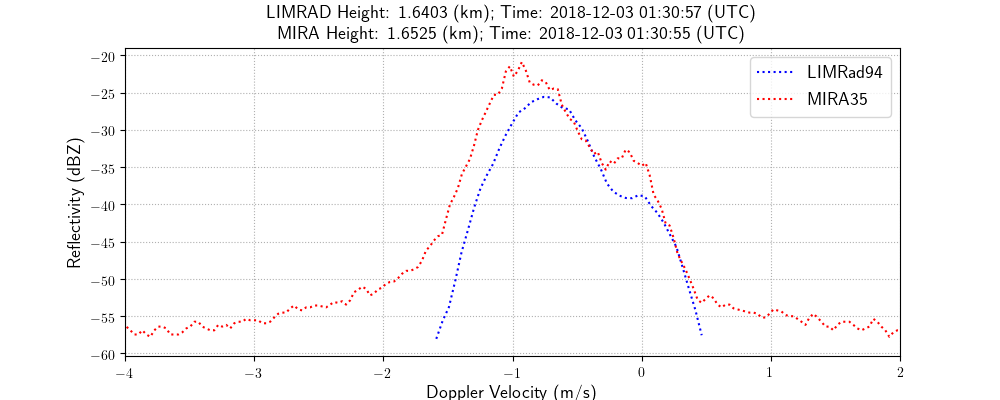
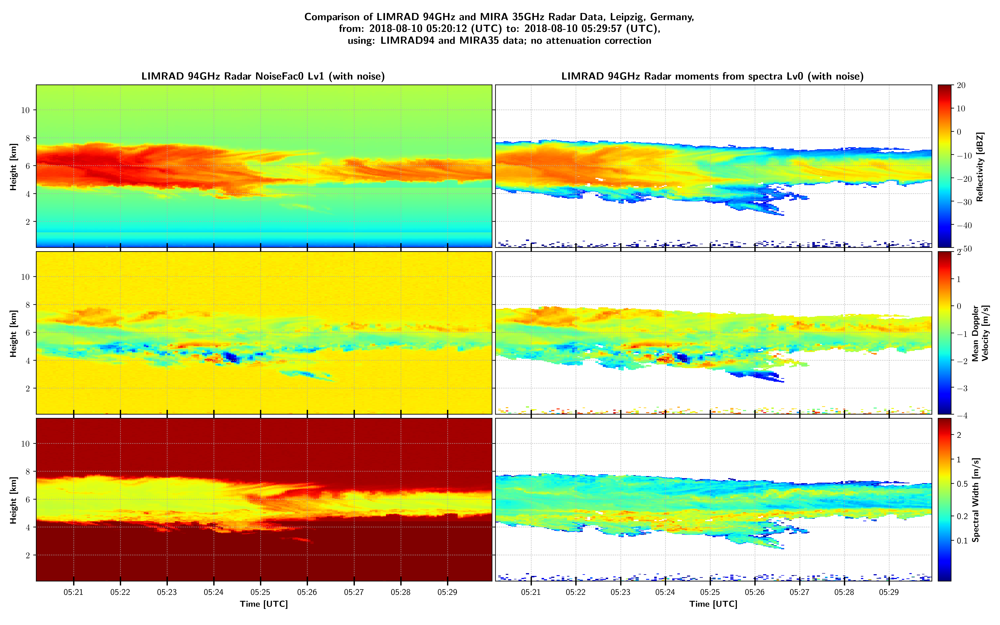

# Descibtion

This is the version 0.1 of the Meteorological-Data-Comparision Package. It's perpous is to investigate RPG 94GHz FMCW Radar 'LIMRAD94' and Metek 35GHz Pulse Radar 'MIRA35' radar data files. The user is able generates quicklooks for quick investigation of radar moments (Ze, mdv, sw, ldr), looking at specific Doppler spectras, plotting them, convert LIMRAD94 data to Cloudnet processing format, etc.


# Installation

  1.  make sure to install Python 3.6 or a later verison, e.g. go to https://www.anaconda.com/download/ and pick a download depending on your operating system (this may take a while)
      
  
  2.  the following packages are nessessarry, type: conda install [packagename]
     
     $ conda install -c anaconda numpy
     $ conda install -c conda-forge matplotlib
     $ conda install -c conda-forge netcdf4
     $ conda install -c anaconda numba 
     $ conda install -c anaconda scipy 
        
  3. Make a copy of Parameter_Mod.py_untouched and save it as Parameter_Mod.py. 
     Then define global paths in Parameter_Mod. NOTE: Do not delete or overwrite Parameter_Mod.py_untouched!
     
    $ cp Parameter_Mod.py_untouched Parameter_Mod.py
    
     Then specify your local paths, e.g.:
     
    - meteo_path  = '[user]/data/MeteoData/'              # path where output is stored, e.g.: png, log, txt
    - LIMRAD_path = '[user]/data/MeteoData/LIMRAD94/'     # main path to LIMRAD94 NetCDF files
    - MIRA_path   = '[user]/data/MeteoData/MIRA/'         # main path to MIRA NetCDF files
   
   The folder structure is as follows:
    
      MIRA_parth/mmclx/[files].mmclx
         --"--  /calibrated/[files].mira
         --"--  /spectra/[files].nc4
                 
      /LIMRAD_path/calibrated/[momentfiles].LV1.NC   
                --"--        /[spectrafiles].LV0.NC           
          
  

# Examples

The scripts/ subfolder contains different excecutable programs, developed for specific tasks. The list below summarizes the main task of all scripts.
 
 - **compare_LIMRad-MIRA_spectra.py:** Generating plots of LIMRAD94 and MIRA35 spectra.
 
    
   
 - **download_plot_sounding.py:** Download and save plot and metadata of soundings of station 'SCCI'. Two external packages have to be installed:
       
       $ conda install -c conda-forge metpy
       $ conda install -c conda-forge siphon
 
   Input parameter: YYYY MM DD HH. Expample call for the routine: 
 
       $ python download_plot_sounding.py 2018 12 3 12
    
    
 - **LIMRAD94_to_Cloudnet.py:** Concatinates LIMRAD94 LV1 files to one daily file and generate a NetCDF4 file for the input to the Cloudnet Matlab routines. Calling the routine from bash requires additional arguments, e.g.: date in YYYYMMDD and time intervall (from-to) in HHMMSS HHMMSS
      
       $ python LIMRAD94_to_Cloudnet.py 20180729 000000 240000
 
 - **Compare_MDFs.py:** Compare the dimensions and variables of two LIMRAD94 files. This is for a quick look of differences in performance of the RPG 94GHz radar. The user specifies two files ( *file1* and *file2* ) in the Compare_MDFs.py script, a list of dimensions and a list of variables of interest. Example lists:
 
 ```python
    constants_to_compare = ['AvgNum', 'NoiseFilt', 'SampDur', 'MaxVel', 'DoppRes']
    variables_to_compare = ['SeqIntTime', 'QualFlag', 'Status', 'TPow']
 ```
 
   Start the routine with:
 
       $ python Compare_MDFs.py
 
 - **Show_spectra.py:** Generates a series of spectrum(dBZ)/normalized spectrum(-)/wavelet transformation plots and save it as png for later concatination to gif file.  
 
       $ python Show_Spectra.py 20180810 0500 0600 0.0 12.0
 
    
 
 - **Spectra_to_Moments.py:** Calculates the radar moments Ze (reflectivity), mdv (mean Doppler velocity), sw (spectral width), skew (skewness), and kurt (kurtosis) from LV0 NetCDF4 files provides by the RPG 94GHz radar. The user is able to specify the number of standart deviations above the mean noise for the threshold where noise is cut. 

    
    

 - **PlaygroundNC_Toolv2.py:** Call to input routines for LIMRAD94 and MIRA35 files, also good for quicklooks.
 
    
